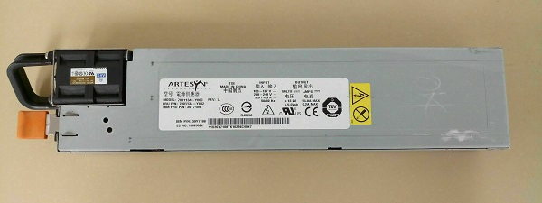
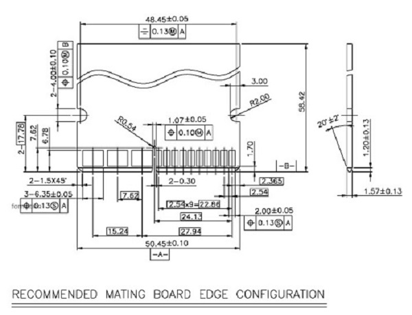
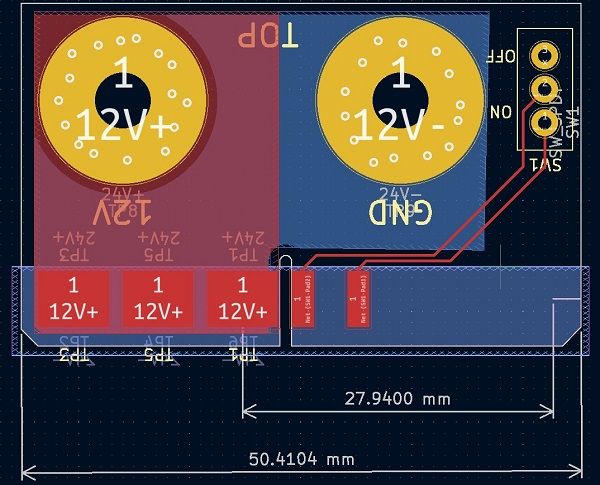
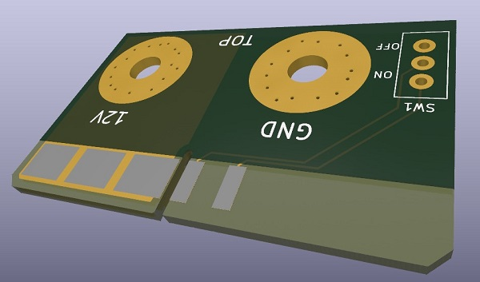
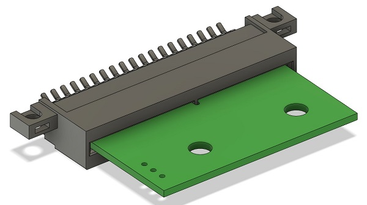
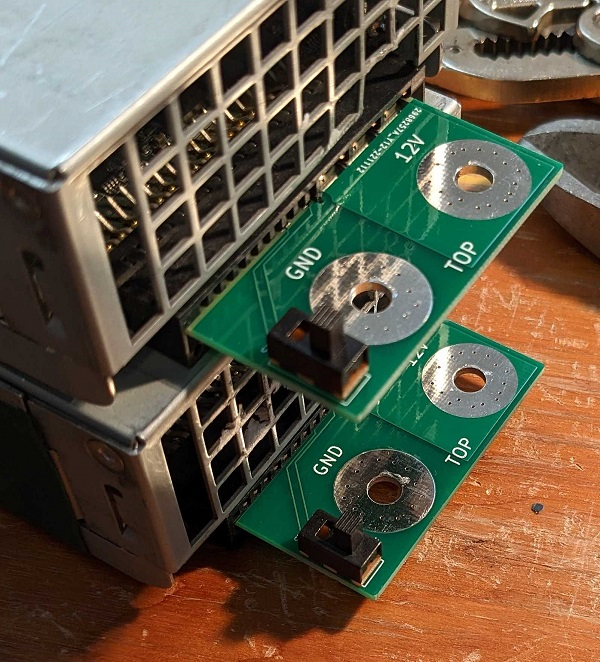

My father happened across some very affordable server power supplies on Ebay and got two such that he could put them in parallel and get a 24V slim form-factor power supply. Server power supplies however are a little unlike typical SMPS due to them having a card-edge connector rather than terminal block. This card edge connector usually will have half of it sectioned off for power and half sectioned off for additional features to interact with the power supply such as ON/OFF control, a DC-OK signal, and some 3.3V and 5V connections. 

Thus, when buying a second-hand generic server power supply online, it may not be so simple as being a plug-and-play device. Such is what my father experienced when buying two Artesyn Technologies model 7001134-Y000 REV L power supplies. He was unable to easily use them as they needed a card-edge connector to get safe access to the 12V output and a jumper to even turn it on.

We therefore decided to quickly design a small adapter board that fit the power supply and gave him ON/OFF control.

## Design Process

We firstly decided that we wanted to convert the power section of card-edge connector to a thru-hole that allowed him to bolt wires to. In addition, a small ON/OFF switch that behaved as the jumper would give him ON/OFF control.

I opened up the power supply and searched for the part number of the card-edge connector. This was fortunately an Amphenol part and it was easy to find proper documentation. Found in the datasheet was the recommended mating board edge configuration shown in the image below.

(Source: "Straddle mount type Power edge connector", GS-12-279, FCI)

From here I laid confirmed the outputs of the connector, added the switch, and laid out the PCB according to the recommended configuration. 

Even though I followed the dimensions shown in the recommended configuration, it is always worthwhile double-checking your work. If you are unable to pass it off to someone else to check, then you need to devise a second verification method. In this case, I was able to download the 3D model of the connector and export a 3D model of the PCB. In Fusion360 I confirmed they fit without interference and was satisfied with ordering the PCBs.

Some design choices were required for the electrical properties of the PCBs as well since these power supplies are rated to output 55A max. As a general rule of thumb for me when dealing with large currents on a PCB I like to:

- Maximize thermal area,
- Maximize trace width (typically with copper fills) and
- Use a track width calculator that uses the max current calculator formula from IPC 2221 to confirm the PCB will stay within reasonable temperatures.

In addition to those measures, we also opted to play it a little safe and when with a more expensive 2oz copper thickness for the PCB.

We got a set of 10 boards manufactured by JLCPCB and ordered up the little ON/OFF switches. After all the components arrived, and a quick little solder job to get the switches in there, we plugged them in and and they worked as expected.

## Conclusion

This little project just goes to show how many design choices are made even to create a connector with an ON/OFF switch. In practice, it can be a balancing act to manage time and effort against necessary result. Over-engineering can be a slippery slope and result in costs larger than expected. I have always had the engineering view that the simplest solution is often the best and there is no need to over-complicate things. With that in mind though, great results are never achieved by implementing the bare minimum.