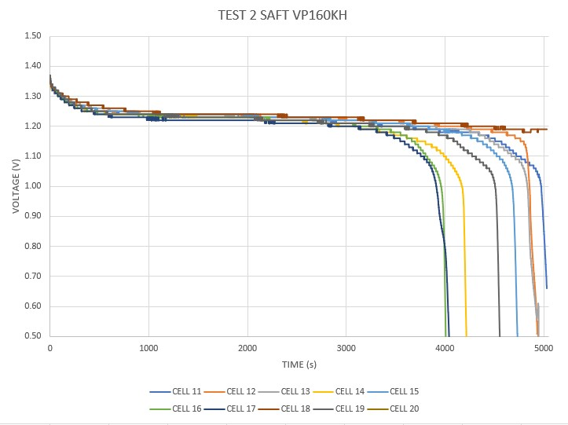
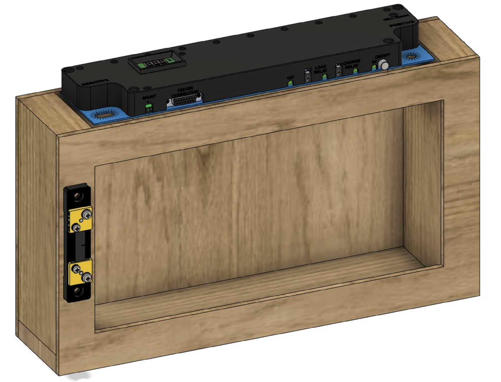
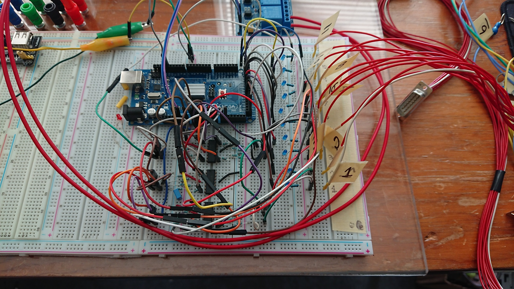

Last updated: 21-Dec-2022

#### Introduction

The emergency power system described here was been an ongoing project that has dabbled in system integration, electrical engineering, PCB design, additive manufacturing, programming, mechanical design, and CNC machining.

The results of the project have been for the benefit of my parents, to provide a service that they sometimes have to be without. The development journey however has been more for my benefit since the problems encountered and challenges all have added to my engineering abilities. 

#### Table of Contents

1. [Introduction](#introduction)
2. [History](#history)
3. [Scope of the Project](#scope-of-the-project)
4. [Designing the System](#designing-the-system)
5. [Sub-Systems](#sub-systems)
    1. [SAFT NiCd Batteries](#saft-nicd-batteries)
    2. [Analyser](#analyser)
    3. [Pack Monitor](#pack-monitor)
    4. [Water System](#water-system)
    5. [Pack Enclosures](#pack-enclosures)
    6. [Charging System](#charging-system)
6. [Future Plans](#future-plans)

#### History

My father is a retired memeber of the armed forces and air force, and spent the rest of his career in aviation, initially as an AME (Aircraft Maintenance Engineer) and eventually as an inspector in the manufacturing department. He is also one to see value in seemingly worthless things. Because of this, he managed to collect several hundred discarded aircraft battery cells. He managed to aquire these cells due to aviation requirements for battery packs, where if the pack's overall capacity drops below 80% of the rated capacity, the pack is deemed unusable. These packs are generally comprised of 20 cells operating at between 1.2V-1.4V for a total battery voltage of 24V-28V (28V is the de facto standard in aviation for the DC bus). It is often the case that only a few of the 20 cells in the pack are the cause of the pack failing it's 80% capacity test, either by thermal runaway or age, while the rest of the cells are near perfect. Thus when an entire pack is rejected, one can test each individual cell and harvest the usable ones. Such is the way my father managed to aquire several hundred over the course of his career.

My parents live in the middle of the woods at the end of a long tree-lined winding road in a rural area. The house shares a local water reservior at the low point of the property with 4 other houses. The reservior is supplied by rainfall and distributed up to the houses via pumps and a large holding tank. They have their own propane tank for admeneties such as a gas stove and gas boiler for the heated floors. This leaves them only relying on the electrical grid for other household appliances and lights etc. However, during the stormy season, it is not uncommon to be without electrical power if a tree falls across the power lines. This disables the water distribution system for the strata, the starter for the boiler and the pumps that pump the hot water through the floor of my parents' house. Thus, when there isn't power, they don't have access to water or heat. In the past, not taking showers, flushing the toilet only once or using rainwater to flush, general preservation of water, and layering up were all actions we took when the power was out for a few hours up to occasionally a few days or even a week once. If there was a dire need to, the communal water storage tank with adjoining pump-house had a generator to provide power to the pump and give the houses some water pressure. 

#### Scope of the Project

Being without heat or water can be difficult most would agree. Such were the opinions of my parents. So, with frequent power failures and a seemingly unlimited supply to electrical energy storage, the decision to make a power storage system with the batteries, which could power a water pump, and some basic amenities around the house such as the boiler's lighter and the in-floor water pumps, was a simple decision to make. Trouble is: How to actually do it and how to incorporate it well into the house? 

The plan was simple:
    1. Be able to power a water pump that could provide water pressure to the house,
    2. use the batteries to power an inverter that could tie into the house's main breaker panel,
    3. and charge the batteries when grid power is avaiable and automatically turn when it is not.

Seems easy enough right? You'd be right. The principles behind our plan were simple, but between the two similar personalities of my father and I, we ended up over-engineering the problem and it has blown up into a project spanning several years and costing several thousand dollars. How long could a generator run on several thousand dollars' worth of gas I wonder? Regardless, we knew what we wanted, we knew we had the skills to accomplish it, all that was left was to get started.

#### Designing the System

- How the cells and packs work. 
- Methods to monitor the battery packs.
- Methods of charging the battery packs.
- Methods of evaluating the usable capacity of the cells.
- Water pump system.
- 

 

#### Sub-Systems

- Talk in detail about the sub-systems.

### SAFT NiCd Batteries

The batteries we are using are discarded aircraft batteries, primarily SAFT VP400KH, VP150KH, and VP160KH NiCd cells. We also have a few russian cells removed from Kamov Helicopters, but not in a quantity suitable for large energy storage. The numbering used by SAFT (a French company) indicate what Amp-Hour you can expect the cell to capable of supplying. For example, the VP400KH battery cell will supply 40 Amp-Hours (Ah).

NiCd batteries have many similarities with lead acid, they both operate in ranges of 1.2V-1.5V, they are constructed in a similar manner having a metalic substance immersed in an electrolyte, and they are both quite safe (they won't explode when exposed to oxygen). The NiCd batteries from SAFT are pretty outstanding for several reasons, namely that they have an incredibly long storage life (some cells we have been using had notes on them indicating they were discarded in 1992), they can be and often are depleted to 0V without degrading the cell, they are desined to be serviced easily, you can visually determine the health of a cell by seeing the behaviour of the electrolyte when charging and discharging through the clear container, and they can easily pump out 50 times their rated capacity for short durations such as starting a turbine of an aircraft.

They do come with a few drawbacks however. NiCd cells can experience thermal run-away when charging or over-charging. If charged at a high rate (a high rate would be 1C or at a rated equal to 1 x Capacity, 40A for the VP400KH), if a cell is fully charged, the excess charging power is converted to heat. If too much heat is generated the cell itself will breakdown and begin shorting internally, leading to further heat generation until a run-away event occurs. Thus when charging these cells at a high rate of charge, it is important to monitor the cell's voltage. Fully charged cells that begin to convert the excess energy to heat will actually drop their voltage potential. The recommended charging system for NiCd includes what is called negative-delta-voltage (NDV) detection, where with change in time, a negative change in voltage indicates the cell is fully charged. This is a protection method that prevents the cell from entering a thermal run-away event when charging.

A second drawback occurs when these cells are arranged in a pack. NiCd cells have a unique discharge curve where once below a certain charge threshold, the voltage potential across the cell drops dramatically to 0V. When the first cell in a NiCd pack is fully discharged and the pack is still supplying current, the cells neighbouring the deplted cell with drive the voltage potential across the depelted cell negative. This ends up converting the cells into a thick plume of smoke. Those who work with electronics far and wide know not to let the magic smoke out. So when using a pack of multiple cells, it is practice to disconnect the pack when the first cell is depleted, which is at 1.0V in the case of SAFT NiCd cells. This protects the entire pack but it means the pack is only as capable as the worst cell. Thus when evaluating the effective capacity of a cell when configured in a pack, a resistor ($1\Omega$, 10W) is placed across the terminals of a cell when it reaches 1.0V (a near depleted state) to burn off the remaining charge. When the cell depletes further to 0.5V, a shorting clip is placed over the terminals, effectively removing it from the pack. 

Below is a graph showing the discharge curves of some SAFT VP160KH cells arranged in a 10-cell pack. Notice that there is an immediate decrease in voltage at the beginning from around 1.4V to around 1.2V and then a sudden drop in cell voltage from 1.0v to essentially 0V when the cell is fully depleted. The region between 1.2V and 1.0V is the usable region of the cell and it is quite noticeable by the duration at which it sustains those voltages. This graph was created using data I extracted from the pack using the analyser I designed. It is noticeable in this pack however, some cells become depleted around 4000s while others become depleted around 5000s, meaning these cells are not well suited to be in a pack together due to their dissimilar capacity. 

Thus to effectively use the cells and arrange them in packs, it is important to balance the pack by putting cells of similar capacity together. This encourages the likelihood of using all the capacity that each cell can provide before the first cell is depleted and the pack must be disconnected from the load. Analysing each cell and arranging packs of similar cells is therefore advised when using high capacity NiCd batteries.

### Analyser

### Pack Monitor

### Water System

### Pack Enclosures

### Charging System

#### Future Plans

- Talk about how we plan to add the VP150 cells to the system
- Talk about how we want to add an inverter for the house to the system
- 

